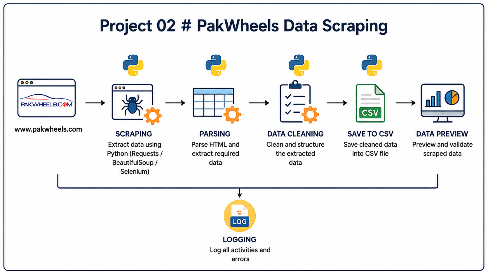

## Data Scrapping

##### Project for Cloud Data Engineering Roadmap

### Project 02 : PakWheels Data Scrapping

- Task 1: Logging function
- Task 2 : Web Scrapping using BeautifulSoup
- Task 3 : Extraction of data
- Task 4 : Transformation of data
- Task 5: Loading to CSV
- Task 6: Loading to Database
- Task 7: Function to Run queries on Database
- Task 8: Verify log entries

## Architecture

